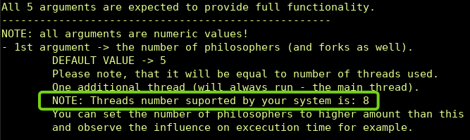
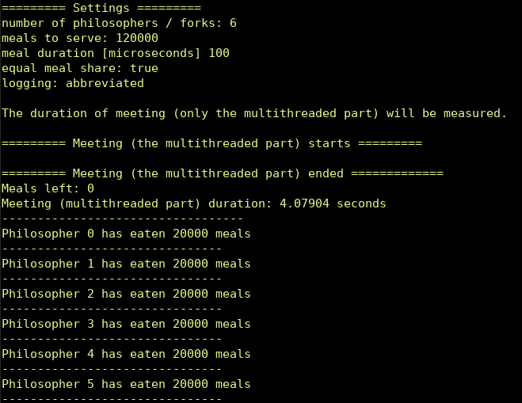
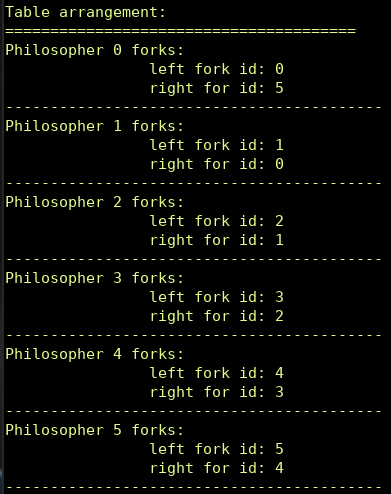
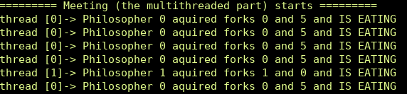
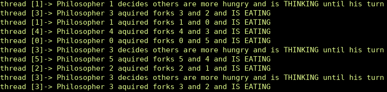
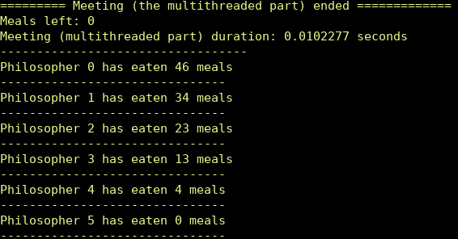
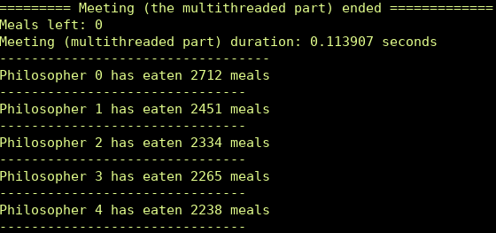
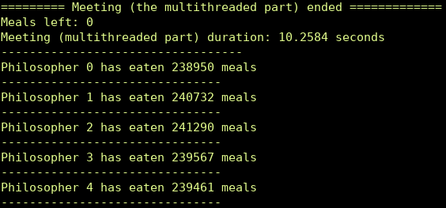

# The Dining Philosophers Problem (solution)

## Introduction
The code in this repository represents my solution to the Dining Philosophers Problem. It is a small console/terminal program.
It was created as an exercise on using multithreaded functionalities.

If you want to go deeper into the Dining Philosophers Problem, it is recommended to read some detailed web description, like  [Wikipedia - Dining Philosophers Problem](https://en.wikipedia.org/wiki/Dining_philosophers_problem).
But in short the the Dining Philosophers Problem looks like this:

There is a meeting of philosophers, during which they are discussing some philosophical ideas (or whatever philosophers discuss).
But as most people, philosophers like to spend long discussions eating some good stuff.
So they are provided with meals and everything would be nice and simple if there were enough forks for every one of them to eat whenever they like.
But the problem assumes that **the number of forks is equal to the number of philosophers** participating in the discussion. And the thing is - **each one of them needs both his forks simultaneously** (one on his left and the other on his right)  to be able to eat.
In order to imagine the problem better (if you haven't seen the wiki link already), consider a round table where the philosophers are sitting. Each one of them has a fork on his left and one on his right side. But for each philosopher, the fork to his right is a left-hand fork of the colleague sitting to his right (and so on).
So there must be some kind of arrangement or agreement between them in order for them to be able to eat. So each philosopher either eats of thinks / discusses some ideas in a single moment of time (waiting to acquire both forks).
My code in this repo represent one possible solution (hopefully a valid one - and if not, please send me your remarks).

## My solution features
When runnig the build program, you are able to provide 5 arguments, which will correspond to its settings:
- **1st argument** -> the **number of philosophers** (and forks as well). Please note, that during the meeting **each philosopher will dine on his own thread**. Please keep in mind, that one additional thread (will always run - the main thread, which controls the program execution);
- **2nd argument** -> total **number of meals to serve**;
- **3rd argument** ->  **duration of meal** in microseconds. The microseconds of course are non realistic when it comes to real meal eating time, but this allows to observe program execution if you would like to serve a couple of millions of meals;
- **4th argument** -> boolean for setting **equal sharing** of meals. You provide this argument as 0 or 1 accordingly:
    0 - no sharing (the system thread scheduler determines final result)
	1 - equal sharing (less efficient but no philosopher will leave hungry ;);
-**5th argument** -> boolean for setting **log detail level** accordingly:
 0 - abbreviated logging
 1 - full logging (***not recommended for high meal number values***, as it will clutter up the console/terminal stream).

**You are required to provide all five arguments.**
The only alternative is to provide no arguments, which will run program with default values set and print the instruction explaining the meaning of each argument to be provided.
**HINT: It might be useful to run the program at least once with the default settings** by providing no arguments like `./Dining-Philosophers-Problem`, not only to see the hint for arguments meaning, but to see the helper information about number of threads provided by you system/machine. This might be helpful for considering the influence of number of philosophers (and therefore threads) used for execution time. The print looks like this:

##### Abbreviated log mode
If you decide to use abbreviated logging mode (which seems likely in my opinion, after you decide to experiment a little bit with number of meals and philosophers) you will see something like this:

So as can be seen, the log print contains:
+ settings passed as parameters to the program
+ information about starting the meeting (the multithreaded part)
+ the summary with: meals left (should always be 0), execution time of the multithreaded part, and the meal share for each philosopher.
##### Full log mode
If you decide to use full log option, you will be provided with additional information:
+ the table arrangement, that is which philosopher owns which fork:

+ info describing which philosopher is currently eating, on which thread and which forks he was able to acquire in order to do so:

+ additionally, **if you decided to share meals equally**, you will be provided with the log prints from philosophers who are very kind and decide to wait until more hungry philosophers eat:

##### No equal-meal-sharing mode
If you decide you don't want to share meals equally, obviously some logs will be missing (the philosophers will eat as soon as the system grants them access to forks, and therefore there will be no log prints from philosophers deciding to wait).
But it will have a more important consequence of unequal number of meals eaten by a particular philosopher. Some philosophers might not even eat at all **(some threads/philosophers could be "starved"**)!

Consider some cases:
- if you run the program like this `./Dining-Philosophers-Problem 6 120 10 0 0` , that is 6 philosophers, 120 meals, 10 microseconds of meal duration, no sharing(0) and abbreviated log(0), you might see a summary like this:

or
- usually if you provide some larger number of meals like with `./Dining-Philosophers-Problem 5 12000 0 0 0`, no philosopher will be starved (at least on my machine), but the meals still are not devided equally:

or
- on my machine, the bigger the number of meals served the relative fairness of sharing provided by the system thread scheduler seems to improve, like when passed 1 200 000 meals to 5 philosophers:

## Invitation to experiment
Many factors will affect the result of the program when run. In fact, each run with the same settings should be slightly different (except "equal-meal-sharing-mode", where meals should be almost always equally shared).
Many of these factors could be set via 5 settings, so quite a lot interesting experiments can be done to understand the complexity of multithreaded programming world.
Consider experimenting with all the combination of parameters:
- philosopher/threads used count - especially in comparison with the number of threads supported by your system and with "share meals equaly" toggled 'on'. You might observe for example, that if you pass number of philosophers radically larger than one supported by your system, the program execution will be radically slower.
As an example, on my 8-threaded machine the same number of meals (140 000), meal duration time set to 0 and abbreviated logs yielded radically different execution times when:
created 7 philosophers -> `./Dining-Philosophers-Problem 7 140000 0 1 0`:

created 14 philosophers -> `./Dining-Philosophers-Problem 14 140000 0 1 0`:

It took about 108 times longer to serve the same meal count! Of course it depends a lot of the program code (the equal sharing was turned on), but might be useful tip for real world programing, when you are about to choose the number of threads used...
- meal count (obviously)
- meal duration time
- meal sharing - my solution is most likely far from perfect, the philosophers decide themselves (in "equal sharing mode") if they are among the most hungry ones, which involves a lot of logic, threads often switch just to check that their assigned work cannot be done and there is a need to switch back to another thread and so on...
- full loging turned on/off - obviously logging to stream takes some considerable time and only one thread can log while others have to wait and stuff like that...

**HAVE FUN WITH EXPLORING ALL THE OPTIONS!!!**
## Pre-requisites for building and running
- **CMake** with mininum version 3.14 installed,
- C++17 compliant compiler (I used gcc 12.1.0 but I believe many previous version are compliant as well).
- **make** or other building system
NOTE: I tried to adjust the CMakeLists.txt to work for Windows as well, but I usually program on Linux environment so it is possible that some slight adjustments might be needed.
If so - I apologize.
## Building and runing
- clone the repository (I assume that you know how),
- go the "Dining-philosophers-problem" folder. Example for Linux:
`cd Dining-philosophers-problem/`
- create building folder. Example for Linux:
  `mkdir build`
- go to the build folder. Example for Linux:
  `cd build`
- run the cmake command. Example for Linux:
`cmake ..`
- run cmake building command. Example for Linux:
  `cmake --build .`
- run the program. Example for Linux:
  with default options: `./Dining-Philosophers-Problem`
  with provided settings for run: for example `./Dining-Philosophers-Problem 6 3600 10 0 1`.
